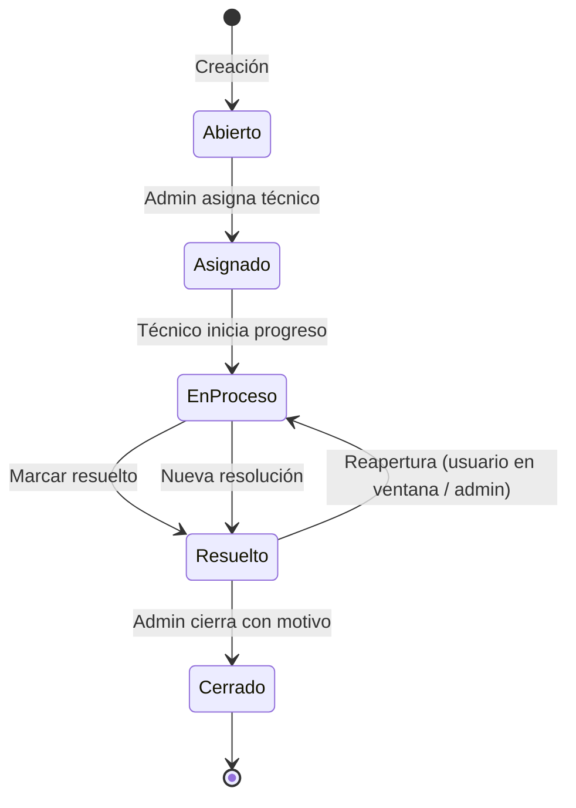

# Flujo de tickets

> Documentación del ciclo de vida, permisos y decisiones de diseño del módulo de tickets.  
> Última revisión: 2026-06-26

---

## 1. Resumen

Un ticket recorre estados lineales hasta **Resuelto**, donde entra en una **ventana de reapertura** configurable. El **cierre definitivo** lo hace solo un administrador, con **motivo obligatorio**. La reapertura conserva el mismo `id` del ticket.

---

## 2. Estados

| ID | Estado       | Descripción |
| -- | ------------ | ----------- |
| 1  | Abierto      | Ticket creado, pendiente de asignación |
| 2  | Asignado     | Ticket asignado a un técnico |
| 3  | En Proceso   | Técnico trabajando en la resolución |
| 4  | Resuelto     | Solución reportada; pendiente de confirmación del usuario o cierre del admin |
| 5  | Cerrado      | Cierre definitivo por administrador |

**Badge "Reabierto":** no es un estado en BD. Tras una reapertura el ticket vuelve a **En Proceso (3)** con `reopened = true` y se muestra el badge en listado y detalle.

---

## 3. Flujo paso a paso

### 3.1 Creación y trabajo

1. Un usuario crea el ticket → estado **Abierto (1)**.
2. Un administrador asigna técnico → **Asignado (2)** (puede ocurrir al editar el ticket).
3. El técnico asignado usa **Iniciar progreso** → **En Proceso (3)**.

### 3.2 Resolución temporal

Desde **Asignado (2)** o **En Proceso (3)**, según el rol:

- **Técnico asignado:** solo desde **En Proceso (3)**.
- **Usuario creador:** desde **Asignado (2)** o **En Proceso (3)**.
- **Administrador:** vía `marcar-resuelto` (mismas reglas de transición que técnico).

Al marcar resuelto:

- `state_id` → 4
- `resolved_at` → `NOW()`
- `reopened` → `false`, `reopened_at` → `NULL`
- Se registra entrada en `ticket_history`

El ticket queda en espera: el usuario puede confirmar tácitamente (no hace nada) o solicitar reapertura dentro de la ventana; el admin puede reabrir o cerrar en cualquier momento.

### 3.3 Ventana de reapertura

- Duración configurable en **Admin → Configuración** (`ticket_reopen_window_hours`).
- Valor por defecto: **48 h** (rango permitido: 1–720 h).
- El cálculo usa `resolved_at` + horas configuradas.
- Solo aplica a tickets en estado **Resuelto (4)**.

**Usuario creador** (botón *¿No se ha solucionado?*):

- Solo si está dentro de la ventana.
- Motivo obligatorio (mín. 5 caracteres).

**Administrador** (botón *Reabrir ticket*):

- Sin límite de ventana.
- Motivo opcional (si se envía, mín. 5 caracteres).

Al reabrir:

- `state_id` → 3, `reopened` → `true`, `reopened_at` → `NOW()`, `resolved_at` → `NULL`
- Historial con `change_type = 'REOPEN'`
- Comentario visible si hay motivo
- Mismo `id` del ticket (no se crea ticket nuevo)

### 3.4 Cierre definitivo

Solo **administrador**, desde cualquier estado distinto de Cerrado:

- Botón **Cerrar ticket** → modal con motivo obligatorio.
- Endpoint dedicado `PATCH /tickets/:id/cerrar` (no vía `PUT /tickets/:id`).
- `state_id` → 5, `closed_at` → `NOW()`, `closure_reason` → texto del motivo.
- Historial con `change_type = 'CLOSE'`.

**Motivos de cierre (UI):** catálogo fijo en frontend (`TICKET_CLOSURE_CATEGORIES`):

| Valor interno | Etiqueta    |
| ------------- | ----------- |
| `solved`      | Solucionado |
| `cancelled`   | Cancelado   |
| `duplicate`   | Duplicado   |
| `other`       | Otro        |

Si se elige *Otro*, el usuario debe describir el motivo (mín. 3 caracteres). En BD se guarda texto legible en `closure_reason` (p. ej. `Solucionado` o `Otro: sin respuesta del usuario`).

**Decisión:** enum fijo en código, no catálogo administrable como las categorías. Suficiente para reportes y simplicidad de implementación.

---

## 4. Permisos por rol

| Acción | Usuario creador | Técnico asignado | Administrador |
| ------ | --------------- | ---------------- | ------------- |
| Crear ticket | Sí | Sí | Sí |
| Editar campos del ticket | No | No (solo estado) | Sí |
| Iniciar progreso (2→3) | No | Sí | Sí |
| Marcar resuelto | Sí (2 o 3) | Sí (solo 3) | Sí |
| Reabrir | Sí (4, en ventana, con motivo) | No | Sí (4, sin límite de ventana) |
| Cerrar definitivamente | No | No | Sí (con motivo) |

**Restricciones adicionales:**

- `PUT /tickets/:id` **rechaza** `state_id = 5`; el cierre debe usar `PATCH /tickets/:id/cerrar`.
- El técnico no puede modificar título, descripción, categoría, prioridad ni asignación; solo estado.
- El botón **Marcar resuelto** en listado y detalle solo aparece en estados 2 o 3 (vuelve a mostrarse tras una reapertura porque el ticket regresa a 3).

---

## 5. Campos relevantes en `tickets`

| Columna | Uso |
| ------- | --- |
| `state_id` | Estado actual (1–5) |
| `resolved_at` | Momento de la última resolución; base de la ventana de reapertura |
| `closed_at` | Momento del cierre definitivo |
| `closure_reason` | Motivo de cierre (texto, obligatorio al cerrar) |
| `reopened` | `true` si fue reabierto y sigue en En Proceso |
| `reopened_at` | Timestamp de la última reapertura |

Configuración global en `system_settings`:

| Clave | Descripción |
| ----- | ----------- |
| `ticket_reopen_window_hours` | Horas de ventana de reapertura tras `resolved_at` |

---

## 6. Endpoints de ciclo de vida

| Método | Ruta | Descripción |
| ------ | ---- | ----------- |
| `PATCH` | `/tickets/:id/iniciar-progreso` | Asignado → En Proceso |
| `PATCH` | `/tickets/:id/marcar-resuelto` | → Resuelto; setea `resolved_at` |
| `PATCH` | `/tickets/:id/reabrir` | Resuelto → En Proceso; body `{ reason? }` |
| `PATCH` | `/tickets/:id/cerrar` | → Cerrado; body `{ closure_reason }` (solo admin) |
| `PUT` | `/tickets/:id` | Edición general; **no** permite pasar a Cerrado |

Historial en `ticket_history` (`change_type`: `UPDATE`, `REOPEN`, `CLOSE`, etc.).

---

## 7. UI

| Elemento | Dónde | Condición |
| -------- | ----- | --------- |
| Iniciar progreso | Listado / detalle | Técnico asignado, estado 2 |
| Marcar resuelto | Listado / detalle | Técnico (3) o usuario creador (2 o 3) |
| ¿No se ha solucionado? | Detalle | Usuario creador, estado 4, dentro de ventana |
| Reabrir ticket | Detalle | Admin, estado 4 |
| Cerrar ticket | Detalle / edición admin | Admin, no cerrado; abre `CloseTicketModal` |
| Badge Reabierto | Listado / detalle | `reopened = true` y estado 3 |
| Horas restantes de reapertura | Listado / detalle | Estado 4 y dentro de ventana |
| Fecha resuelta / cerrada / motivo | Detalle | Según campos poblados |

Panel unificado de tickets: pestañas en `/tickets` (asignados / creados) — ver [IDEA_UNIFICAR_PANEL_TICKETS.md](IDEA_UNIFICAR_PANEL_TICKETS.md).

---

## 8. Decisiones de diseño cerradas

| Tema | Decisión |
| ---- | -------- |
| Ventana de reapertura | Configurable en admin; default 48 h |
| Reapertura | Solo botón explícito (no por comentario) |
| Estado "Reabierto" | Badge sobre En Proceso, no estado en BD |
| Motivo al marcar Resuelto | No obligatorio |
| Motivo al cerrar | Obligatorio; enum fijo en UI + texto en BD |
| Quién cierra | Solo administrador, endpoint dedicado |
| Quién reabre | Usuario (en ventana) o admin (sin límite) |
| Quién marca Resuelto | Técnico, admin y usuario creador (reglas por estado) |
| `resolved_at` | Se setea al marcar resuelto |
| Conservar ID al reabrir | Sí; mismo ticket, historial continuo |
| Historial de reapertura | `ticket_history` con `change_type = 'REOPEN'` |

---

## 9. Trabajo pendiente (fuera del flujo principal)

| Ítem | Notas |
| ---- | ----- |
| Máquina de estados estricta | Validar todas las transiciones en backend (hoy hay reglas por endpoint, no un modelo unificado) |
| Auto-cierre tras ventana | Job opcional: Resuelto sin respuesta → Cerrado (Solucionado) |
| Tests E2E del flujo | Resuelto → reapertura → En Proceso → Cerrado |

---

## 10. Referencias en el código

| Área | Ubicación |
| ---- | --------- |
| Estados por defecto | `server/database/schema.sql` |
| Tabla `tickets` | `server/database/migration_2026-02-25_22-07-00_create_tickets.sql` |
| `resolved_at`, ventana | `server/database/migration_2026-06-16_14-00-00_add_ticket_reopen_window_settings.sql` |
| `reopened`, `reopened_at` | `server/database/migration_2026-06-16_16-00-00_add_ticket_reopen_columns.sql` |
| `closure_reason` | `server/database/migration_2026-06-24_12-00-00_add_ticket_closure_reason.sql` |
| Controlador | `server/src/controllers/ticketController.js` |
| Ventana de reapertura | `server/src/services/ticketReopenService.js` |
| Modelo | `server/src/models/Ticket.js` |
| Rutas | `server/src/routes/ticketRoutes.js` |
| Motivos de cierre (UI) | `client/src/constants/index.ts` |
| Detalle y acciones | `client/src/pages/TicketDetail.tsx` |
| Modales | `client/src/components/tickets/CloseTicketModal.tsx`, `ReopenTicketModal.tsx` |
| Config. ventana (admin) | `client/src/pages/AdminConfig.tsx` |
| Reportes y métricas de ciclo | `server/src/models/Ticket.js` (`getLifecycleMetrics`), `client/src/pages/ReportsPage.tsx`, `client/src/pages/TicketsDashboard.tsx` |

---

## 11. Ideas relacionadas

- [Unificar panel de control con tickets](IDEA_UNIFICAR_PANEL_TICKETS.md) — **implementado** (pestañas en `/tickets`)
