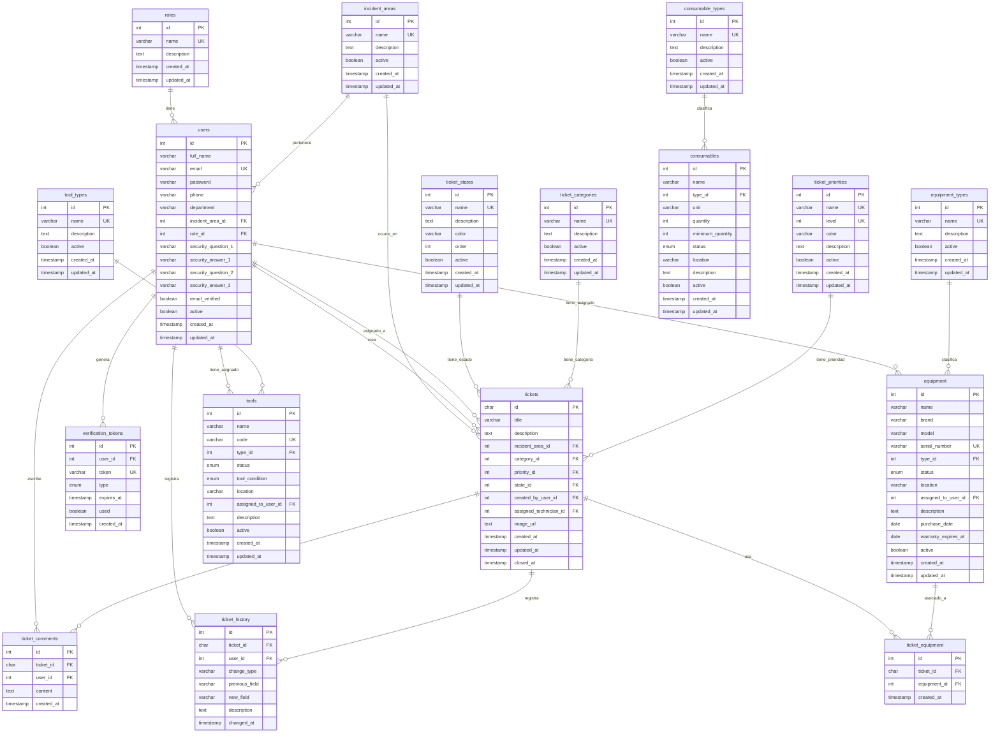

# Diagrama de Entidad-Relación (ER)

Diagrama de la base de datos del Sistema de Gestión de Soporte Técnico.

## Descripción de Relaciones

### Módulo de Usuarios y Autenticación
- **roles** → **users**: Un rol puede tener muchos usuarios (1:N)
- **incident_areas** → **users**: Un área de incidentes puede tener muchos usuarios (1:N)
- **users** → **verification_tokens**: Un usuario puede tener muchos tokens (1:N)

### Módulo de Tickets
- **ticket_states** → **tickets**: Un estado puede tener muchos tickets (1:N)
- **ticket_categories** → **tickets**: Una categoría puede tener muchos tickets (1:N)
- **ticket_priorities** → **tickets**: Una prioridad puede tener muchos tickets (1:N)
- **incident_areas** → **tickets**: Un área puede tener muchos tickets (1:N)
- **users** → **tickets** (creador): Un usuario puede crear muchos tickets (1:N)
- **users** → **tickets** (técnico): Un usuario puede ser asignado a muchos tickets (1:N)
- **tickets** → **ticket_comments**: Un ticket puede tener muchos comentarios (1:N)
- **tickets** → **ticket_history**: Un ticket puede tener muchos registros de historial (1:N)
- **users** → **ticket_comments**: Un usuario puede escribir muchos comentarios (1:N)
- **users** → **ticket_history**: Un usuario puede registrar muchos cambios (1:N)

### Módulo de Inventario - Equipos
- **equipment_types** → **equipment**: Un tipo puede tener muchos equipos (1:N)
- **users** → **equipment**: Un usuario puede tener asignados muchos equipos (1:N)
- **tickets** → **ticket_equipment**: Un ticket puede usar muchos equipos (N:M)
- **equipment** → **ticket_equipment**: Un equipo puede estar asociado a muchos tickets (N:M)

### Módulo de Inventario - Consumibles
- **consumable_types** → **consumables**: Un tipo puede tener muchos consumibles (1:N)

### Módulo de Inventario - Herramientas
- **tool_types** → **tools**: Un tipo puede tener muchas herramientas (1:N)
- **users** → **tools**: Un usuario puede tener asignadas muchas herramientas (1:N)

## Notas Importantes

- **PK**: Primary Key (Clave Primaria)
- **FK**: Foreign Key (Clave Foránea)
- **UK**: Unique Key (Clave Única)
- Las relaciones N:M se resuelven mediante tablas intermedias (ej: `ticket_equipment`)
- Los timestamps `created_at` y `updated_at` están presentes en la mayoría de las tablas para auditoría
- El campo `active` permite soft-delete en varias entidades
